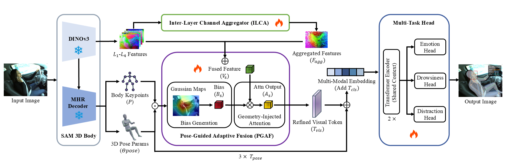

# Geo-DMS: Geometry-Aware Multi-Task Driver Monitoring via Pose-Guided Adaptation of SAM 3D Body

   

This repository holds the official implementation of the paper: **"Geo-DMS: Geometry-Aware Multi-Task Driver Monitoring via Pose-Guided Adaptation of SAM 3D Body"**.

Currently, the paper is under review at *The Visual Computer* (TVC).

## 💡 Method Overview

The architecture of the Geo-DMS framework built upon the frozen SAM 3D Body framework (DINOv3 backbone & MHR decoder), the pipeline employs an Inter-Layer Channel Aggregator (ILCA) to unify global semantics ($F_{agg}$) and a Pose-Guided Adaptive Fusion (PGAF) module to inject geometric priors via a parallel strategy.

  
   
  <em>Figure 1: The overall framework of our proposed Geo-DMS.</em>

 

## 📢 Code Release & Coming Soon

We are actively organizing and cleaning up the source code.

**The full implementation code and pretrained models will be publicly released upon the paper's acceptance.**

Please start ("⭐️") this repository to receive notifications about the code release and updates.

## ✅ To-Do List

- [x] Paper submission
- [x] Release preprint (Research Square)
- [ ] **Code release (Coming soon upon acceptance)**
- [ ] Release pretrained weights
- [ ] Add detailed installation and usage instructions
